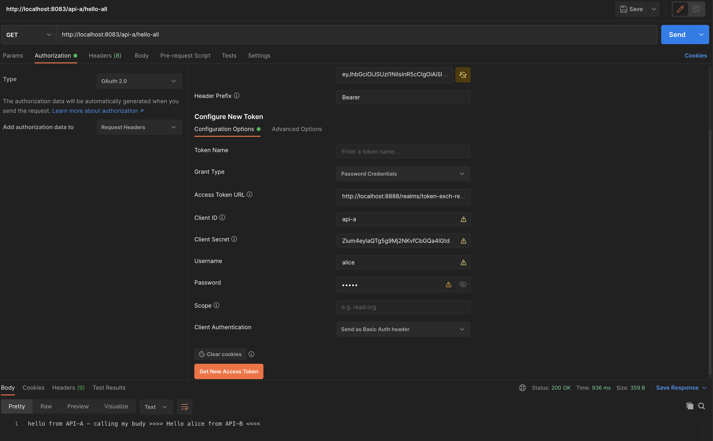

# Spring Token-Exchange with Keycloak

After you checked out the project, run the following command:

`mvn clean verify`

- ### Run Keycloak

  - Download Keycloak from https://www.keycloak.org/downloads (used v18.0.0 during dev)
  - Edit the conf/keycloak.conf file to specify a port add: `http-port=8888`
  - Run the following command to start Keycloak :   `bin/kc.sh start-dev -Dkeycloak.profile.feature.token_exchange=enabled -Dkeycloak.profile.feature.admin_fine_grained_authz=enabled`
  - These profiles are required because token-exchange feature is still in preview.

- ### Importing Realm
  - In Keycloak interface click "add-realm" and import : `realm-export.json`
  - You'll have to create users yourself. Left Menu > Users > Add user > Username: alice > Save > Credentials > Password: alice > Password Confirmation: alice > Temporary: OFF > Save.

 

## Interactions schema

                                     Manually authenticates       ┌───────────────────────────────┐
                                     to Client "api-a" and        │                               │
                                     receives an access_token     │                               │
                                                1                 │                               │
                                  ───────────────────────────────►│          KEYCLOAK             │
                 Resource Owner                                   │                               │
                                 ◄─────┐                          │                               │
                        │              │                          │                               │
                        │              │ 7 resturns response      └───────────────────────────────┘
                        │              │                             ▲                ▲         ▲
                        │              │                             │                │         │
                        │              │                             │                │         │
                        │              │    Requests a Token-Exchange│                │         │
                        │              │    from current audience client "api-a"      │         │
                        │              │    to audience of "api-b"   │                │         │
                        │     ┌────────┴──────┐          4bis        │                │         │
                        │     │ Resource      ├──────────────────────┘                │         │
                     2  │     │ Server        │                                       │         │
                        └────►│               ├───────────────────────────────────────┘         │
    Calls /api-a/hello-all    │   /API-A      │          3  /API-A verifies token validity      │
    with access_token in      │               │◄───┐        (audience matchs server client-id)  │
    Authorization header      │               │    │                                            │
    (with audience of "api-a")└────┬──────────┘    │                                            │
                                   │               │                                            │
                                   │               │ 6 returns response                         │
                                   │               │                                            │
                                   │               │                                            │
                                   │     ┌─────────┴─────┐                                      │
                                   │     │ Resource      │                                      │
                                4  │     │ Server        │                                      │
                                   └────►│               ├──────────────────────────────────────┘
             Calls /api-b/hello          │   /API-B      │         5  /API-B verifies token validity
             with exchanged access_token │               │            (audience matchs server client-id)
             (with audience of "api-b")  │               │
                                         └───────────────┘

 

- The "token-exchange" is implemented by an ExchangeFilterFunction filter added on the WebClient used to call the "/api-b/hello" endpoint.
- There is no caching for this exchanged token in this demo, so each request triggers a token-exchange request with Keycloak.
- A special "token-exchange" permission is defined in Keycloak on client "api-b" to allow requests from client "api-a".
   
   
   

## 🚀 Calling the "/api-a/hello-all" endpoint

 

- Must ask for an Oauth2 access_token, which can be done easily in postman like this:

 

 </img>
